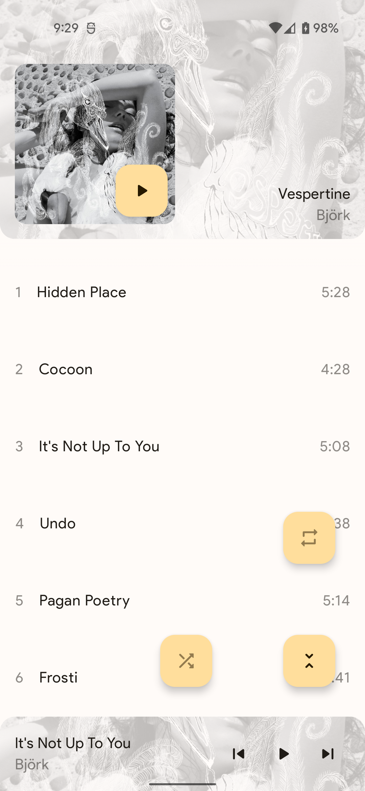
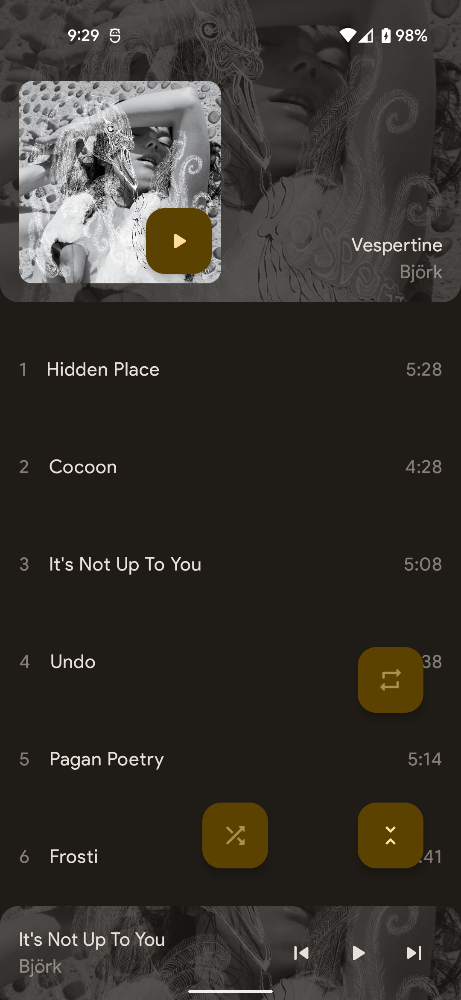
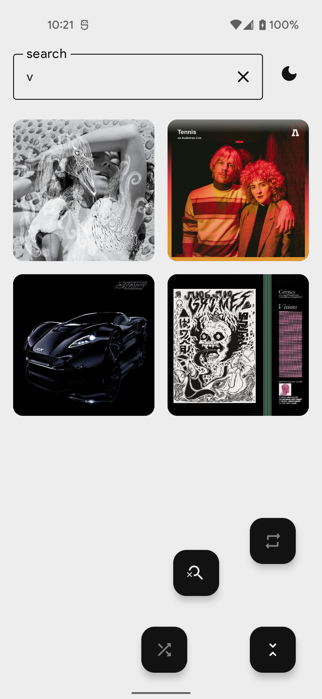

# enemy

enemy is a supplemental code sample written by @buggily. While exhibition is the primary purpose of enemy, @buggily uses enemy as their dedicated audio player in everyday life!

### Overview

enemy provides browsing and playback by album. Background playback is supported by a media service, and the corresponding media notification is available in both the notification tray and on the lock screen. enemy adopts the early beta of Media3 to achieve a familiar playback experience. Enhancements are planned to follow a stable Media3 release.

### Implementation

enemy demonstrates the following:

- Dependency injection via [Hilt][hilt]
- Positional paging via [Paging3][paging]
- Audio playback via [Media3][media]
- Declarative layouts via [Jetpack Compose][compose]
- Image loading via [Coil][coil]
- Unidirectional data flow via [MVVM][mvvm]

### Setup

Because enemy is a strictly local client, setup simply involves cloning the repository, provided audio files exist on the device. Run in [Android Studio][android studio] or any Android IDE.

*enemy in dynamic dark and light dynamic modes*

*enemy in static light and dark modes*

[hilt]: https://developer.android.com/training/dependency-injection/hilt-android/
[paging]: https://developer.android.com/topic/libraries/architecture/paging/v3-overview
[media]: https://developer.android.com/guide/topics/media/media3
[compose]: https://developer.android.com/jetpack/compose/
[coil]: https://coil-kt.github.io/coil/
[mvvm]: https://developer.android.com/topic/architecture/
[android studio]: https://developer.android.com/studio
